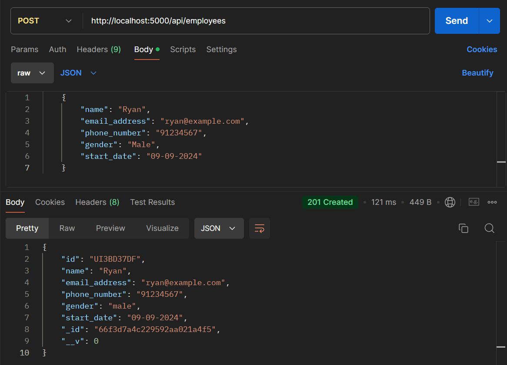

# API Endpoints


In this document are sample data and responses for the various API endpoints offered.

Do note the following:

- `id` field would need to be replaced with your own. `id`s can be retrieved from Mongo Atlas or by `GET` requests in Postman.
- The `id` field refers to the `id` assigned to the café or employee entity, NOT the Mongo document ID.
- Fields for the API requests surround by `[square brackets]` are optional fields.

## Table
- [Cafés API](#cafés-api)
  - [GET request](#get-cafes---retrieve-all-cafés-or-filter-by-location)
  - [POST request](#post-cafes---add-a-new-café)
  - [PUT request](#put-cafesid---update-an-existing-café)
  - [DELETE request](#delete-cafesid---delete-a-café)

- [Employees API](#employees-api)
  - [GET request](#get-employees---retrieve-all-employees-or-relevant-employees-filtered-by-café) 
  - [POST request](#post-employees---add-a-new-employee)
  - [PUT request](#put-employeesid---update-an-existing-employee)
  - [DELETE request](#delete-employeesid---delete-an-existing-employee)

## Cafés API

### `GET /cafes` - Retrieve all cafés or filter by location
To retrieve all cafés:
```
http://localhost:5000/api/cafes
```

To filter by location:
```
http://localhost:5000/api/cafes?location=<location>
```
The `GET` request has an optional `location` parameter. The location should be entered without quotations, replacing `<location>`.

The response should return status `200 OK`.

The response body should contain relevant cafes with the following fields:
- `id`: the id of the café.
- `name`: the name of the café.
- `description`: the description of the café.
- `employees`: the number of employees at the café.
- `location`: the location of the café.


### `POST /cafes` - Add a new café.
```
http://localhost:5000/api/cafes
```

The `POST` request body should contain the following fields:

  - `name`: the name of the café.
  - `location`: the location of the café.
  - `description`: the description, introduction of the café.

Sample input:

```
{
    "name": "Bananas Cafe",
    "location": "Singapore",
    "description": "Buhnanas!"
}
```

The response should return status `201 Created`.

### `PUT /cafes/:id` - Update an existing café.
```
http://localhost:5000/api/cafes/b8c3573c-e25d-4051-a937-9a9723aa699c
```
Take note to modify the `id` parameter in the URL accordingly.

The `PUT` request should have the café's `id` as a URL parameter. In this example, the `id` is b8c3573c-e25d-4051-a937-9a9723aa699c. 

The request body should contain the following fields:

  - `name`: the name of the café.
  - `location`: the location of the café.
  - `description`: the description, introduction of the café.

Note that all fields must be included, otherwise it may be overwritten.

Sample input:
```
{
    "name": "Bananas Cafe",
    "location": "Singapore",
    "description": "Apples? Buhnanas!"
}
```
The response should return status `200 OK`.

### `DELETE /cafes/:id` - Delete a café.
```
http://localhost:5000/api/cafes/b8c3573c-e25d-4051-a937-9a9723aa699c
```

The `DELETE` request should have the café's `id` as a URL parameter. In this example, the `id` is b8c3573c-e25d-4051-a937-9a9723aa699c.

The response should return status `200 OK`.


## Employees API

### `GET /employees` - Retrieve all employees or relevant employees filtered by café.
To retrieve all employees:
```
http://localhost:5000/api/employees
```

To filter by café:
```
http://localhost:5000/api/employees?cafe=<café>
```
The `GET` request has an optional `cafe` parameter. The cafe `id` should be entered without quotations, replacing `<café>`.

The response should return status `200 OK`.

The response body should contain relevant employees with the following fields:
- `id`: the id of the employee.
- `name`: the name of the employee.
- `email_address`: the email address of the employee.
- `phone_number`: the phone number of the employee.
- `days_worked`: the number of days the employee has worked.
- `cafe`: the json containing the `id` and `name` of the café the employee is assigned to.
- `gender`: the employee's gender.


### `POST /employees` - Add a new employee.
```
http://localhost:5000/api/employees
```

The `POST` request body should contain the following fields:

  - `name`: the name of the employee.
  - `email_address`: the email address of the employee. Should be unique.
  - `phone_number`: the phone number of the employee. Should be unique and follow Singapore's phone number format of starting with 8 or 9 and having 8 digits.
  - `gender`: the gender of the employee. Should be male or female.
  - `[start_date]`: the start date of the employee. Should be in 'DD-MM-YYYY' format. If not provided, it defaults to the current date.
  - `[cafe]`: the `id` of the café assigned to the employee.

Sample input:

```
{
    "name": "Ryan",
    "email_address": "ryan@example.com",
    "phone_number": "91234567",
    "gender": "Male",
    "start_date": "09-09-2024"
}
```

The response should return status `201 Created`.

### `PUT /employees/:id` - Update an existing employee.
```
http://localhost:5000/api/employees/UI3BD37DF
```
Take note to modify the `id` parameter in the URL accordingly.

The `PUT` request should have the employee's `id` as a URL parameter. In this example, the `id` is UI3BD37DF. 

The request body should contain the following fields:

  - `name`: the name of the employee.
  - `email_address`: the email address of the employee. Should be unique.
  - `phone_number`: the phone number of the employee. Should be unique and follow Singapore's phone number format of starting with 8 or 9 and having 8 digits.
  - `gender`: the gender of the employee. Should be male or female.
  - `[start_date]`: the start date of the employee. Should be in 'DD-MM-YYYY' format. If not provided, it retains the previous start date.
  - `[cafe]`: the `id` of the café assigned to the employee. If not provided, will be dropped.

Note that all fields must be included, otherwise it may be overwritten unless otherwise indicated.

Sample input:
```
{
    "name": "Ryan",
    "email_address": "ryan@example.com",
    "phone_number": "91234567",
    "gender": "Male",
    "start_date": "09-09-2024",
    "cafe": "b8c3573c-e25d-4051-a937-9a9723aa699c"
}
```
The response should return status `200 OK`.


### `DELETE /employees/:id` - Delete an existing employee.

```
http://localhost:5000/api/employees/UI3BD37DF
```

The `DELETE` request should have the employee's `id` as a URL parameter. In this example, the `id` is UI3BD37DF.

The response should return status `200 OK`.
